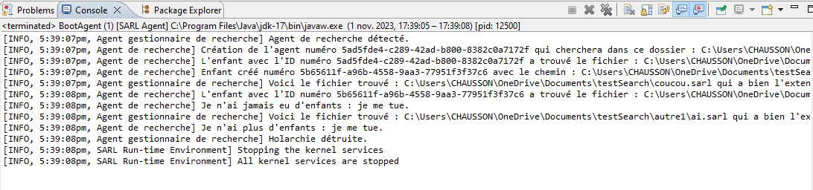

# Holonic Search

## Introduction

Using agent programming, we have developed a holonic search system.
It allows searching for files with a specific extension in a folder and its subfolders.
The system consists of a holonic agent that will create search agents for each folder and subfolder, returning the path of this file to an agent that manages the search.
At the end of the search, all agents are destroyed, if and only if they no longer have children.

Here is an example of the hierarchy of our holonic search system:
- folder 1
    - test.txt
    - coucou.sarl
    - folder 2
        - ai.sarl

## Results

Here is an example of a search result:

## Installation

Create a new SARL project by creating a `holonicSearch` package and adding the files `Boot.sarl`, `SearchManager.sarl`, `SearchDir.sarl`, `Events.sarl` to the `src/main/sarl` folder.

The SARL documentation is available [here](http://www.sarl.io/docs/index.html).

## Lab Support

[Lab Support](./AI51-F2023-Lab2-HolonicSearch.pdf)
